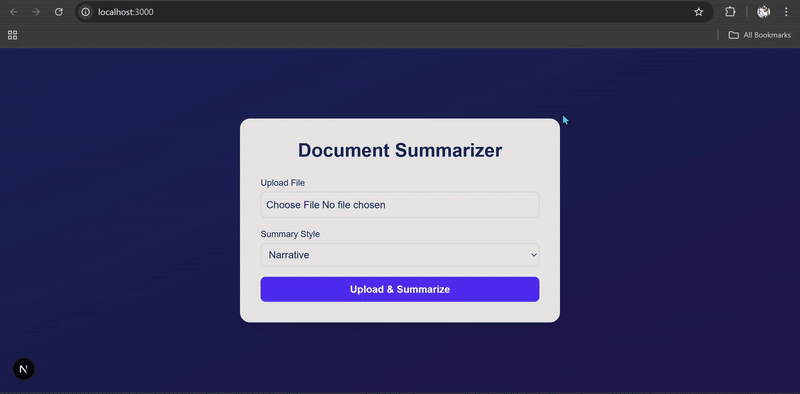
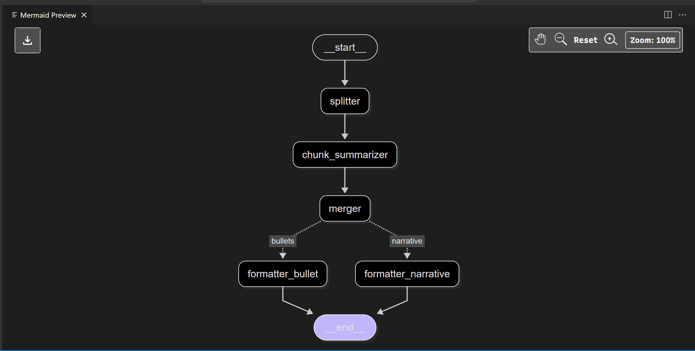

# Document Summarizer

An end-to-end application that summarizes uploaded documents (`.pdf`, `.docx`) into either **narrative** or **bullet-point** style summaries.

The project consists of:

-  **Backend** : FastAPI with document loading, text extraction, and summarization agents.
-  **Frontend** : Next.js + TailwindCSS for a clean and interactive UI.

## Demo

[]

## Key Libraries

#### LangGraph

A framework for designing and orchestrating agent workflows as graphs. It makes it easier to break down complex reasoning into nodes and edges, helping the summarization process stay modular and traceable.

#### LangChain

A library that simplifies building applications powered by LLMs. It provides abstractions for connecting language models with tools (like document loaders, retrievers, or APIs) — essential for chaining together document ingestion and summarization.

#### Transformers

Hugging Face’s library that provides access to a wide variety of state-of-the-art transformer-based models (BERT, GPT, T5, etc.). In this project, it underpins the summarization capability by supplying the core NLP model(s).

#### langchain_openai

A LangChain integration that connects to OpenAI’s models. It allows you to plug OpenAI LLMs (e.g., GPT) directly into your LangChain pipeline for summarization.

## Tech Stack

- **Backend** : FastAPI, Python, Langraph, Transformers/OpenAI.
- **Frontend** : Next.js 14, React, Tailwind CSS.
- **Utilities** : Mermaid for diagrams, CORS for API calls.


#### Clone the repository
```sh
git clone https://github.com/bosukeme/document-summarizer-langgraph.git
cd document-summarizer
```

## Backend Setup (FastAPI)

1. Navigate to backend:

   ```sh
   cd backend
   ```

2. Create a virtual environment and install dependencies:

   ```sh
   python -m venv venv

   # Linux, MacOs
   source venv/bin/activate

   # On Windows:
   venv\Scripts\activate

   pip install -r requirements.txt
   ```

3. Configure environment variables:

   ```sh
    # copy content of .env.sample into .env
    .env
   ```

   Fill in keys (optional if trying out just the transformer).

4. Start the server:
   ```sh
   uvicorn main:app --reload
   ```

Backend will run at:

`http://127.0.0.1:8000`

Open API docs:

`http://127.0.0.1:8000/docs`

<br>

## Frontend Setup (Next.js + Tailwind)

1. Navigate to frontend:
   ```sh
   cd frontend
   ```
2. Install dependencies:
   ```sh
   npm install
   ```
3. Set environment variables:
   - Create `.env.local`:
     ```sh
     NEXT_PUBLIC_API_BASE_URL=http://127.0.0.1:8000
     ```
4. Run development server:
   ```sh
   npm run dev
   ```
   Frontend will run at:

`http://localhost:3000`

## Usage

1. Open the frontend (`http://localhost:3000`).
2. Upload a `.pdf` or `.docx`.
3. Choose summary style (Narrative or Bullets).
4. Click **Upload & Summarize** .
5. Copy result with **📋 Copy** button.


## Starting with Docker
To start both servers at once, you can use
```sh
docker-compose up --build
```
Once its up and running, you can view it on `http://localhost:3000`

## Architecture

Mermaid diagram of summarization flow (from `doc_summarizer.mmd`):



## Contributing

If you would like to contribute, please follow these steps:

1. Fork repo.
2. Create feature branch: `git checkout -b feature/your-feature`.
3. Commit changes and push.
4. Open a Pull Request.

## Author

Ukeme Wilson

- <a href="https://www.linkedin.com/in/ukeme-wilson-4825a383/">Linkedin</a>.
- <a href="https://medium.com/@ukemeboswilson">Medium</a>.
- <a href="https://www.ukemewilson.site/">Website</a>.
